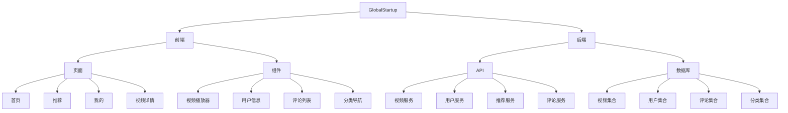

# GlobalStartup 系统模式

## 系统架构
- 前后端分离架构
- MVC设计模式
- RESTful API接口
- 基于组件的UI设计

## 架构图

## 设计模式
- 组件化开发: 将UI拆分为可复用的组件
- 数据驱动视图: 使用数据绑定更新UI
- 单向数据流: 确保数据流向清晰
- 发布-订阅模式: 用于组件间通信
- 工厂模式: 创建数据模型实例
- 代理模式: 处理API请求和响应

## 前端模块
- 视频列表模块: 展示视频列表，支持分页和筛选
- 视频播放模块: 处理视频播放、暂停、进度控制
- 用户认证模块: 处理登录、注册、授权
- 个人中心模块: 管理用户个人信息和收藏
- 评论模块: 展示和提交评论
- 搜索模块: 提供搜索功能

## 后端模块
- 视频管理模块: 处理视频元数据和内容
- 用户管理模块: 处理用户数据和认证
- 推荐引擎模块: 基于用户行为生成推荐
- 评论管理模块: 处理评论的创建和读取
- 分析模块: 收集和分析用户行为数据

## 数据流
1. 用户打开小程序 → 加载首页
2. 首页请求视频数据 → 展示视频列表
3. 用户点击视频 → 跳转到视频详情页
4. 视频详情页请求视频数据和评论 → 播放视频并展示评论
5. 用户操作(点赞、评论、收藏) → 发送请求到后端 → 更新数据库

## 性能优化策略
- 延迟加载: 按需加载内容
- 数据缓存: 缓存常用数据减少请求
- 图片优化: 使用适当尺寸和格式的图片
- 代码分割: 拆分代码提高加载速度
- 预加载: 预先加载可能需要的内容 