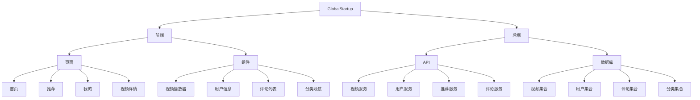
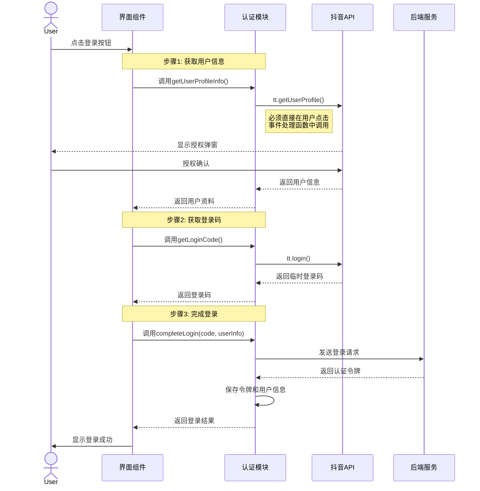
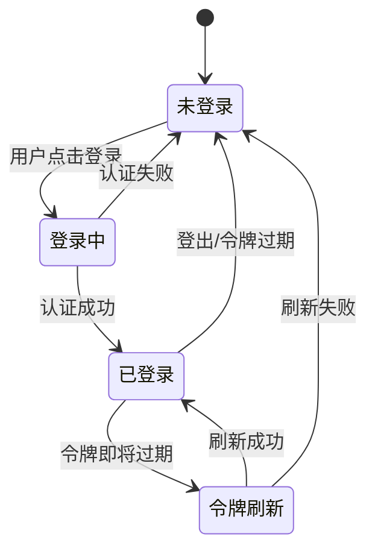
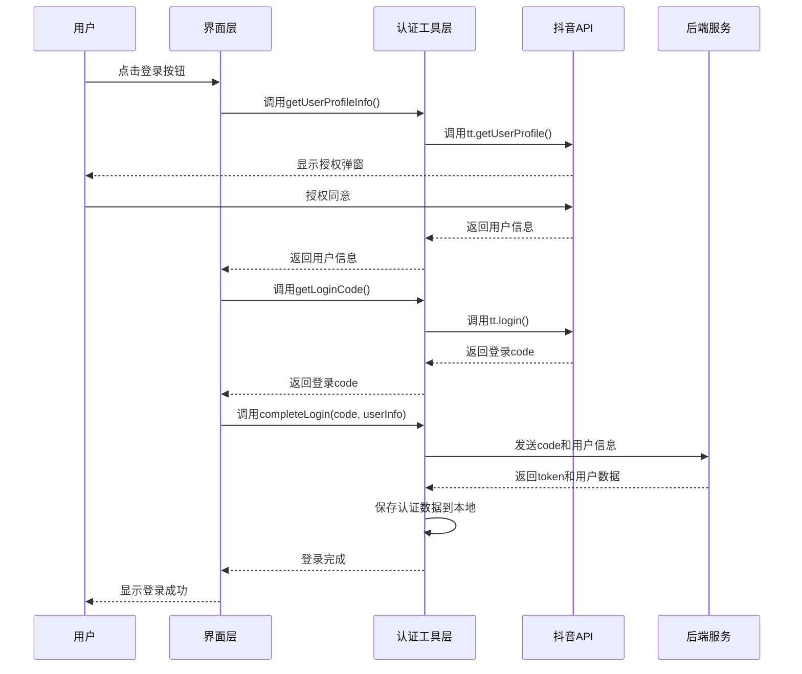
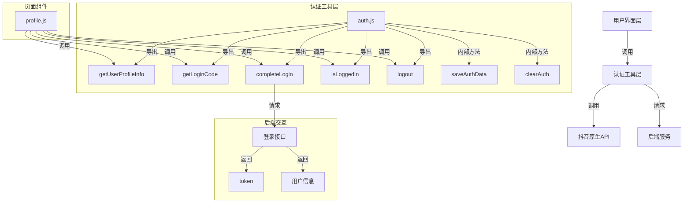
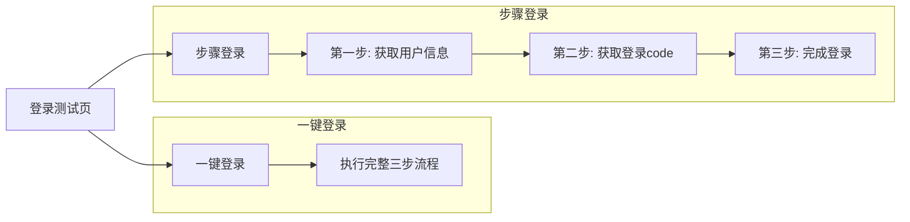
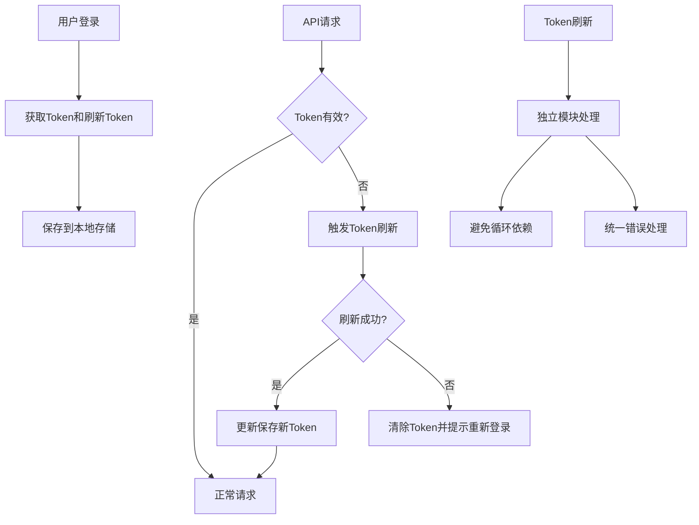
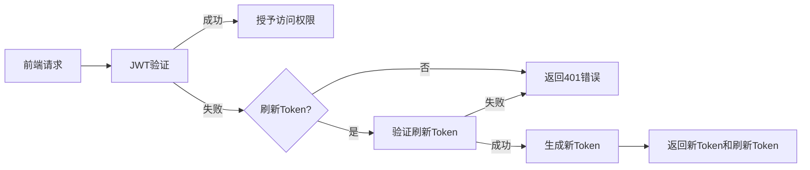

# GlobalStartup 系统模式

## 系统架构
- 前后端分离架构
- MVC设计模式
- RESTful API接口
- 基于组件的UI设计

## 架构图


## 设计模式
- 组件化开发: 将UI拆分为可复用的组件
- 数据驱动视图: 使用数据绑定更新UI
- 单向数据流: 确保数据流向清晰
- 发布-订阅模式: 用于组件间通信
- 工厂模式: 创建数据模型实例
- 代理模式: 处理API请求和响应
- 适配器模式: 处理不同API返回格式的数据结构
- 策略模式: 多种视频URL提取策略封装到工具类

## 前端模块
- 视频列表模块: 展示视频列表，支持分页和筛选
- 视频播放模块: 处理视频播放、暂停、进度控制
- 用户认证模块: 处理登录、注册、授权
- 个人中心模块: 管理用户个人信息和收藏
- 评论模块: 展示和提交评论
- 搜索模块: 提供搜索功能
- 视频处理工具模块: 处理视频数据标准化和URL提取

## 后端模块
- 视频管理模块: 处理视频元数据和内容
- 用户管理模块: 处理用户数据和认证
- 推荐引擎模块: 基于用户行为生成推荐
- 评论管理模块: 处理评论的创建和读取
- 分析模块: 收集和分析用户行为数据

## 数据流
1. 用户打开小程序 → 加载首页
2. 首页请求视频数据 → 展示视频列表
3. 用户点击视频 → 跳转到视频详情页
4. 视频详情页请求视频数据和评论 → 播放视频并展示评论
5. 用户操作(点赞、评论、收藏) → 发送请求到后端 → 更新数据库

## 性能优化策略
- 延迟加载: 按需加载内容
- 数据缓存: 缓存常用数据减少请求
- 图片优化: 使用适当尺寸和格式的图片
- 代码分割: 拆分代码提高加载速度
- 预加载: 预先加载可能需要的内容

## 权限与认证模式

### 登录授权架构

#### 三步登录流程

以下流程图展示了优化后的登录流程，确保符合抖音小程序API规范：



#### 登录架构关键组件

1. **认证工具模块 (`auth.js`)**
   - 核心功能：实现登录流程、管理认证状态
   - 主要方法：
     - `getUserProfileInfo()`: 获取用户资料信息
     - `getLoginCode()`: 获取临时登录码
     - `completeLogin()`: 完成登录过程
     - `isLoggedIn()`: 检查登录状态
     - `logout()`: 登出用户
     - `clearAuth()`: 清除认证数据
     - `saveAuthData()`: 保存认证数据

2. **认证状态管理 (`authManager.js`)**
   - 核心功能：处理认证错误和过期
   - 主要责任：
     - 监听401错误
     - 触发登录态刷新
     - 处理认证失败场景

3. **网络请求模块 (`request.js`)**
   - 核心功能：处理所有API请求
   - 认证集成：自动添加认证令牌
   - 错误处理：转发认证错误至authManager

#### 登录状态管理



#### 用户信息获取策略

1. **首次登录**：通过`tt.getUserProfile()`获取用户信息，必须在用户点击事件中直接调用
2. **登录状态下**：优先使用本地存储的信息，必要时通过后端API刷新
3. **信息更新**：当用户资料变更时，通过`updateUserProfile()`更新本地和后端数据

#### 设计决策与权衡

1. **三步分离式登录的优势**
   - 更好的错误隔离和处理
   - 符合抖音小程序API规范
   - 更易于测试和调试
   - 可单独重用各步骤功能

2. **潜在挑战**
   - 增加了实现复杂度
   - 需要更细致的状态管理
   - 必须确保正确的调用顺序

3. **设计模式应用**
   - 使用Promise链管理异步流程
   - 采用模块化设计分离关注点
   - 实现观察者模式监听认证状态变化

### 用户会话管理

会话管理采用token-based认证模式：

1. **认证数据存储：**
   - 用户token存储在本地存储中
   - 登录状态由`isLoggedIn()`函数统一管理，检查token是否存在且有效
   - 用户信息分别存储在本地，必要时通过API刷新

2. **请求拦截与认证：**
   - 网络请求通过统一的request模块处理
   - 自动为请求添加Authorization header
   - 401错误统一处理，清除认证信息并跳转登录页

3. **登出流程：**
   - 清除本地存储中的所有认证数据
   - 重置应用状态
   - 返回登录页面

4. **异常处理：**
   - 授权失败提供友好提示
   - token过期自动处理
   - 网络错误统一展示 

## 关键设计模式：抖音授权登录实现

### 1. 抖音小程序API约束适配模式

#### 直接用户交互API调用模式
- **模式描述**: 确保特定API必须直接在用户交互事件处理函数中调用，不能通过Promise链或其他异步方式间接调用
- **应用场景**: `tt.getUserProfile()`等需要用户明确授权的API
- **实现方式**: 
  ```javascript
  // ✓ 正确实现 - 直接在事件处理函数中调用
  handleLogin() {
    tt.getUserProfile({
      desc: '用于完善会员资料',
      success: (res) => {
        // 处理成功响应
      },
      fail: (err) => {
        // 处理错误
      }
    });
  }
  
  // ✗ 错误实现 - 通过Promise链或其他函数间接调用
  handleLogin() {
    this.getCode().then(() => {
      tt.getUserProfile({ /* ... */ }); // 将失败，因为不是直接在用户点击事件中调用
    });
  }
  ```

### 2. 登录流程设计模式

#### 三步分离式登录模式
- **模式描述**: 将登录流程分解为三个独立步骤，每个步骤负责单一职责
- **组成步骤**:
  1. 获取用户信息 (`getUserProfileInfo`)
  2. 获取登录码 (`getLoginCode`)
  3. 完成登录 (`completeLogin`)
- **优势**:
  - 符合抖音API调用约束
  - 提高错误隔离和处理能力
  - 便于测试和调试每个步骤
  - 各步骤可独立重用

#### 顺序Promise链模式
- **模式描述**: 使用Promise链管理登录步骤的顺序执行，确保每个步骤完成后才进行下一步
- **实现方式**:
  ```javascript
  // 在用户点击事件中直接调用getUserProfileInfo
  handleLogin() {
    auth.getUserProfileInfo()
      .then(userInfo => {
        // 保存用户信息
        this.setData({ userInfo });
        // 获取登录码
        return auth.getLoginCode();
      })
      .then(code => {
        // 完成登录
        return auth.completeLogin(code, this.data.userInfo);
      })
      .then(loginResult => {
        // 处理登录成功
        this.updateLoginStatus('登录成功');
      })
      .catch(err => {
        // 处理错误
        this.updateLoginStatus(`登录失败：${err.message}`);
      });
  }
  ```

### 3. 测试与调试模式

#### 步骤分离测试模式
- **模式描述**: 在测试页面中为每个登录步骤提供单独的触发按钮和状态显示
- **优势**:
  - 可单独测试每个步骤的功能
  - 精确定位问题所在步骤
  - 提供详细的状态反馈

#### 状态可视化反馈模式
- **模式描述**: 提供清晰的状态指示器，显示每个步骤的执行状态和结果
- **实现方式**:
  - 使用状态卡片显示当前登录状态
  - 对每个步骤的结果提供视觉反馈
  - 在UI上明确显示错误信息和解决建议

### 4. 错误处理模式

#### 层级化错误处理
- **模式描述**: 在不同层级捕获和处理错误，提供适当的用户反馈
- **实现层级**:
  1. API调用层: 捕获API错误并转换为标准格式
  2. 认证模块层: 处理登录相关特定错误
  3. UI层: 将技术错误转换为用户友好消息

#### 错误信息标准化
- **模式描述**: 将各种错误转换为统一格式，包含错误码、消息和上下文信息
- **优势**:
  - 便于集中处理和显示错误
  - 提高错误分析和解决效率
  - 支持国际化和自定义错误消息 

## 用户认证系统架构

### 认证流程设计模式

项目采用了分步认证模式，确保符合抖音小程序API调用规范并优化用户体验：



### 用户认证组件关系



### 关键设计决策

1. **分步登录模式**
   - 将登录流程拆分为三个独立步骤：获取用户信息、获取登录码、完成登录
   - 优势：符合抖音API要求，方便调试，提高错误处理精度
   - 劣势：代码稍微复杂，需要维护多个Promise链

2. **登录状态管理**
   - 采用本地存储（Storage）保存token和用户信息
   - 登录状态判断基于token存在与否
   - 登出操作清除所有认证相关数据

3. **错误处理策略**
   - 每个认证步骤单独处理错误，提供具体错误信息
   - 登录失败时提供明确的用户指导
   - 测试模式下显示详细错误信息便于调试

### 测试系统设计

为支持认证流程的测试和调试，实现了专用测试页面：



测试页面支持：
- 实时显示每个步骤的执行状态
- 展示详细的错误信息
- 允许独立测试每个登录步骤
- 提供清晰的视觉反馈 

## 抖音API设计模式和最佳实践

### 直接用户交互API调用模式

**描述**：
抖音小程序的某些API（如getUserProfile）必须直接由用户交互事件触发，不能在回调或Promise链中调用。

**实现要点**：
- API调用必须直接绑定到用户点击事件处理程序中
- 避免在Promise链或异步回调中调用这些API
- 使用状态管理来协调API调用流程

**示例**：
```javascript
// 正确示例：直接在用户点击处理函数中调用
handleLogin() {
  // 直接由用户点击触发
  getUserProfileInfo()
    .then(profileInfo => {
      // 后续处理...
    });
}

// 错误示例：在Promise链中调用
someOtherFunction()
  .then(() => {
    // 这里会失败，因为不是直接由用户交互触发
    return getUserProfileInfo();
  });
```

### 令牌管理设计模式

**描述**：
实现可靠的令牌管理系统，包括存储、刷新和恢复机制，确保用户认证状态持久且可恢复。

**关键组件**：

1. **多策略令牌存储**
   - 主存储：使用小程序的存储系统存储令牌
   - 备份存储：在多个备用键中存储令牌
   - 内存缓存：在应用全局状态中保持令牌副本
   - 验证机制：实现存储后的令牌验证

2. **自动令牌刷新**
   - 令牌过期预测：提前检测即将过期的令牌
   - 后台刷新：无需用户交互自动刷新令牌
   - 刷新失败处理：实现降级策略和用户提示

3. **错误恢复机制**
   - 多层次恢复策略：从多个存储位置尝试恢复
   - 备用令牌验证：验证备用令牌有效性
   - 降级访问模式：无令牌情况下的基本功能保证

**示例**：
```javascript
// 令牌管理者实现
const tokenManager = {
  // 存储策略
  saveToken(token) {
    // 主存储
    tt.setStorageSync('token', token);
    
    // 备份存储
    tt.setStorageSync('token_backup', token);
    
    // 应用全局变量
    getApp().globalData._token = token;
    
    // 验证存储
    return this.verifyToken();
  },
  
  // 自动刷新
  autoRefreshIfNeeded(thresholdMinutes = 10) {
    if (this.isTokenExpiringSoon(thresholdMinutes)) {
      return this.refreshToken();
    }
    return Promise.resolve(this.getToken());
  },
  
  // 错误恢复
  recoverToken() {
    // 从各种备份中尝试恢复
    let token = tt.getStorageSync('token') || 
                tt.getStorageSync('token_backup') || 
                getApp().globalData._token;
                
    if (token) {
      // 验证恢复的令牌
      return this.verifyTokenValidity(token);
    }
    
    return Promise.resolve(null);
  }
};
```

### 401错误处理模式

**描述**：
实现全面的401未授权错误处理系统，能够自动尝试恢复认证状态并提供优雅的降级访问。

**关键组件**：

1. **错误识别**
   - 多格式401错误检测：识别各种API响应中的401错误
   - 错误上下文提取：获取错误详情以辅助诊断

2. **自动恢复流程**
   - 令牌刷新尝试：检测401后自动尝试刷新令牌
   - 多级回退策略：在主要刷新失败后尝试备用令牌
   - 认证重试：使用新令牌重试原始请求

3. **降级访问**
   - 无认证API路径：提供不需要认证的API访问方式
   - 最小功能保证：确保核心功能在认证失败时仍可用
   - 用户体验维护：提供清晰的状态反馈

**实现示例**：
```javascript
// 401错误处理
function handle401Response(error, retryAction) {
  // 检测是否为401错误
  const is401 = error.status === 401 || 
               (error.data && error.data.statusCode === 401);
               
  if (is401) {
    // 尝试刷新令牌
    return tokenManager.refreshToken()
      .then(newToken => {
        if (newToken) {
          // 使用新令牌重试原始请求
          return retryAction();
        } else {
          // 尝试使用备用令牌
          return tokenManager.recoverToken()
            .then(backupToken => {
              if (backupToken) {
                // 使用备用令牌重试
                return retryAction();
              } else {
                // 降级访问
                return fallbackAccess();
              }
            });
        }
      });
  }
  
  // 非401错误正常处理
  return Promise.reject(error);
}

// 降级访问示例
function fallbackAccess() {
  // 使用无需认证的API端点
  return api.getPublicData()
    .then(data => {
      // 处理有限的公开数据
      return {
        data: data,
        isLimited: true,
        needLogin: true
      };
    });
}
```

### JWT令牌解析适配器模式

**描述**：
实现灵活的JWT令牌解析策略，能够处理标准和自定义格式的令牌，增强系统兼容性。

**关键组件**：

1. **多格式解析器**
   - 标准JWT解析：处理标准结构的JWT令牌
   - 自定义格式解析：支持项目特定的令牌格式
   - 降级解析策略：在标准方法失败时尝试备用解析

2. **令牌信息提取**
   - 用户ID提取：从各种令牌中提取用户标识
   - 过期时间处理：解析和验证令牌过期信息
   - 权限信息提取：获取令牌中的用户权限数据

**实现示例**：
```javascript
// JWT解析适配器
const jwtAdapter = {
  // 尝试从各种格式的令牌中提取用户ID
  extractUserId(token) {
    // 1. 尝试标准JWT解析
    try {
      const payload = this.parseStandardJWT(token);
      if (payload && payload.id) {
        return payload.id;
      }
    } catch (e) {
      console.log('标准JWT解析失败:', e.message);
    }
    
    // 2. 尝试自定义格式解析
    try {
      // 检查是否为 mock_token_1001 格式
      if (token.startsWith('mock_')) {
        const parts = token.split('_');
        const potentialId = parts[parts.length-1];
        if (!isNaN(potentialId)) {
          return parseInt(potentialId);
        }
      }
    } catch (e) {
      console.log('自定义格式解析失败:', e.message);
    }
    
    // 3. 尝试从令牌文本中提取ID模式
    try {
      const matches = token.match(/(?:user|id)[_-](\d+)/i);
      if (matches && matches[1]) {
        return parseInt(matches[1]);
      }
    } catch (e) {
      console.log('ID模式提取失败:', e.message);
    }
    
    return null;
  },
  
  // 标准JWT解析
  parseStandardJWT(token) {
    const parts = token.split('.');
    if (parts.length !== 3) {
      throw new Error('非标准JWT格式');
    }
    
    // 尝试标准Base64解码
    try {
      return JSON.parse(Buffer.from(parts[1], 'base64').toString());
    } catch (e) {
      // 尝试URL安全Base64解码
      const base64 = parts[1].replace(/-/g, '+').replace(/_/g, '/');
      return JSON.parse(Buffer.from(base64, 'base64').toString());
    }
  }
};
```

## Strapi用户查询设计模式与最佳实践

### 用户查询架构

Strapi框架中用户查询有多种方法，必须使用正确的路径和参数才能确保查询成功。下面是针对GlobalStartup项目的用户查询最佳实践。

#### 1. 用户查询层次结构

**模型选择优先级**:
1. `plugin::users-permissions.user` - 标准Strapi用户表
2. `api::user.user` - 自定义用户表

**查询方法优先级**:
1. `strapi.entityService.findMany()` - 高级API，支持复杂查询和关联
2. `strapi.db.query().findOne()` - 直接数据库查询，更稳定但功能较少
3. `strapi.query()` - 旧版API，不推荐使用

#### 2. 用户查询模式

```javascript
// 推荐方法 - 使用entityService
async function findUserByEntityService(userId) {
  try {
    const users = await strapi.entityService.findMany('plugin::users-permissions.user', {
      filters: { id: userId },
      limit: 1
    });
    return users && users.length > 0 ? users[0] : null;
  } catch (error) {
    console.error('高级查询失败，尝试备用方法', error.message);
    return findUserByDirectQuery(userId);
  }
}

// 备用方法 - 直接数据库查询
async function findUserByDirectQuery(userId) {
  try {
    // 注意：使用正确的查询路径 strapi.db.query 而非 strapi.query
    return await strapi.db.query('plugin::users-permissions.user').findOne({
      where: { id: userId }
    });
  } catch (error) {
    console.error('直接查询失败', error.message);
    return null;
  }
}
```

#### 3. 用户查询错误处理

**常见错误**:
- 使用错误的用户模型路径
- 尝试加载不存在的关联字段
- 使用过时的API方法

**解决方案**:
- 实现多层查询机制，尝试多种方法查询用户
- 避免使用未确认的关联字段
- 始终使用`strapi.db.query`而非`strapi.query`
- 在查询失败时记录详细日志帮助诊断

### 用户缓存策略

为提高系统性能，实现有效的用户缓存机制。

#### 1. 全局用户缓存模式

```javascript
// 初始化全局缓存
if (!global.userCache) {
  global.userCache = {};
}

// 使用令牌作为键存储用户ID
function cacheUserByToken(token, userId) {
  global.userCache[token] = userId;
  return userId;
}

// 从缓存获取用户ID
function getUserFromCache(token) {
  return global.userCache[token] || null;
}
```

#### 2. 缓存查询流程

实现分层查询策略，优先使用缓存:

1. 检查令牌缓存 - 如存在直接返回用户ID
2. 解析令牌提取用户ID - 成功则存入缓存
3. 查询用户验证存在性 - 确认用户存在后更新缓存
4. 多模型回退查询 - 尝试不同模型查询用户

#### 3. 部署和同步考虑

- 在分布式环境中考虑使用Redis代替内存缓存
- 实现缓存过期机制避免陈旧数据
- 考虑用户更新后的缓存失效策略

### JWT解析与用户验证模式

完善的JWT解析和用户验证流程如下:

```javascript
async function validateUserFromJWT(token) {
  // 步骤1: 检查缓存
  const cachedUserId = global.userCache?.[token];
  if (cachedUserId) {
    return cachedUserId;
  }
  
  // 步骤2: 标准JWT解析
  try {
    const decodedToken = await strapi.plugins['users-permissions'].services.jwt.verify(token);
    if (decodedToken && decodedToken.id) {
      // 验证用户存在性
      const userExists = await verifyUserExists(decodedToken.id);
      if (userExists) {
        // 存入缓存
        if (global.userCache) global.userCache[token] = decodedToken.id;
        return decodedToken.id;
      }
    }
  } catch (error) {
    console.log('标准JWT验证失败，尝试备用方法');
  }
  
  // 步骤3: 手动JWT解析
  try {
    const jwt = require('jsonwebtoken');
    const jwtSecret = strapi.config.get('plugin.users-permissions.jwtSecret');
    const manualDecoded = jwt.verify(token, jwtSecret);
    
    if (manualDecoded && manualDecoded.id) {
      // 验证用户存在性
      const userExists = await verifyUserExists(manualDecoded.id);
      if (userExists) {
        // 存入缓存
        if (global.userCache) global.userCache[token] = manualDecoded.id;
        return manualDecoded.id;
      }
    }
  } catch (error) {
    console.log('手动JWT解析失败');
  }
  
  return null;
}

// 用户存在性验证 - 使用可靠的查询方式
async function verifyUserExists(userId) {
  try {
    // 尝试方法1: 使用entityService (推荐)
    const users = await strapi.entityService.findMany('plugin::users-permissions.user', {
      filters: { id: userId },
      limit: 1
    });
    if (users && users.length > 0) return true;
    
    // 尝试方法2: 直接数据库查询
    const userRecord = await strapi.db.query('plugin::users-permissions.user').findOne({
      where: { id: userId }
    });
    if (userRecord) return true;
    
    // 尝试方法3: 自定义用户表查询
    const customUser = await strapi.db.query('api::user.user').findOne({
      where: { id: userId }
    });
    if (customUser) return true;
    
    return false;
  } catch (error) {
    console.error('用户验证查询失败:', error.message);
    return false;
  }
}
```

这种多层设计提供了强大的容错能力，确保即使在各种复杂情况下系统也能可靠地识别用户。 

## 认证系统设计与最佳实践

### Token管理与刷新机制

经过对401认证错误问题的解决，我们建立了以下Token管理最佳实践：

#### 前端Token管理模式



#### 关键设计决策

1. **模块职责分离**
   - `tokenManager.js`: 负责Token的存储、获取和管理
   - `request.js`: 处理API请求和401错误响应
   - `externalApi.js`: 处理Token刷新请求，避免循环依赖

2. **令牌刷新策略**
   - 采用队列模式处理并发请求
   - 使用标记防止重复刷新
   - 刷新成功后自动重试所有等待的请求

3. **错误处理机制**
   - 精细化的错误类型区分
   - 统一的用户提示策略
   - 详细的日志记录，便于问题诊断

#### Strapi后端认证配置



#### 后端认证优化

1. **路由定义最佳实践**
   - 避免重复定义相同路由
   - 明确区分插件和自定义路由
   - 使用统一的路由命名规范

2. **查询方法选择**
   - 使用`strapi.entityService`替代`strapi.db.query`
   - 正确设置关系查询格式
   - 添加查询错误处理和备选策略

3. **令牌验证增强**
   - 多层次验证机制
   - 回退验证策略
   - 详细的验证日志记录

### 认证系统错误处理

在实践中，我们发现并解决了以下典型问题：

1. **循环依赖陷阱**
   - 问题：`request.js`需要`tokenManager.js`来获取token，而`tokenManager.js`需要`request.js`来刷新token
   - 解决：创建独立的`externalApi.js`模块处理token刷新，切断循环依赖链

2. **路由冲突问题**
   - 问题：同一路由在不同位置定义，导致处理器冲突
   - 解决：集中路由定义，避免重复，明确优先级规则

3. **URL构建不匹配**
   - 问题：前端构建的URL与后端路由定义不一致
   - 解决：统一URL构建逻辑，确保路径格式匹配

4. **Strapi版本API变化**
   - 问题：Strapi v5中查询API与文档示例不同
   - 解决：更新为最新的entityService API，采用正确的查询格式

## 用户认证架构

### Strapi认证系统

#### 关键知识点

1. **路由访问控制**
   - Strapi默认对所有API端点启用认证保护
   - 登录和注册等公共端点必须**显式**配置为免认证访问
   - 必须在路由配置中添加`auth: false`选项才能创建完全公开的端点
   - 配置示例:
     ```javascript
     {
       method: 'POST',
       path: '/auth/tt-login',
       handler: 'api::user.user.ttLogin',
       config: {
         auth: false,  // 关键配置，禁用此路由的认证要求
         policies: [],
         middlewares: [],
       },
     }
     ```

2. **常见认证配置错误**
   - 未设置`auth: false`导致登录端点返回403错误
   - 认证策略(policies)配置错误导致路由无法访问
   - 仅修改handler但未正确配置路由访问权限

3. **最佳实践**
   - 针对不同类型的认证端点使用一致的配置模式
   - 为登录、注册、Token刷新等公共端点统一设置`auth: false`
   - 在控制器层面实现必要的安全验证
   - 使用详细日志记录认证相关操作，便于诊断问题

#### 认证路由类型

| 路由类型 | 认证要求 | 配置 | 示例 |
|---------|---------|------|------|
| 登录端点 | 无需认证 | `auth: false` | `/auth/tt-login` |
| Token刷新 | 无需认证 | `auth: false` | `/auth/refresh-token` |
| 用户注册 | 无需认证 | `auth: false` | `/auth/register` |
| 受保护资源 | 需要认证 | 默认 | `/api/user-collections` |
| 公共资源 | 无需认证 | `auth: false` | `/api/videos` |

## 认证与授权模式

### 令牌管理最佳实践

在简化令牌管理机制过程中，我们总结了以下最佳实践：

1. **简化优先**：
   - 在小程序环境中，复杂的令牌刷新机制往往带来更多问题
   - 使用较长JWT有效期（如30天）配合简单的存储机制，可以提供更稳定的体验
   - 避免过度工程化的备份和恢复策略

2. **存储策略**：
   - 使用`tt.setStorageSync`进行令牌持久化
   - 关键数据（如令牌）采用多重验证确保读取成功
   - 读取失败时提供明确的错误日志

3. **错误处理**：
   - 401错误不应立即清除令牌，先验证是真实授权问题
   - 对关键API调用使用try-catch包装
   - 授权失败时，提供友好的用户重新登录引导

### API调用错误处理模式

针对API请求错误，特别是认证相关错误，我们建立了以下模式：

1. **预防性验证**：
   ```javascript
   // 调用API前先验证令牌
   if (!tokenManager.isLoggedIn()) {
     showLoginDialog();
     return Promise.reject(new Error('需要登录'));
   }
   ```

2. **错误检测与分类**：
   ```javascript
   // 区分不同类型的错误
   const isAuthError = error.statusCode === 401 || 
                       (error.data && error.data.statusCode === 401);
   const isPermissionError = error.statusCode === 403;
   ```

3. **优雅降级**：
   ```javascript
   try {
     // 尝试调用API
     const result = await api.someProtectedEndpoint();
     return result;
   } catch (error) {
     console.error('API调用失败:', error);
     // 降级策略：显示默认状态
     return defaultValue;
   }
   ```

4. **用户反馈**：
   当遇到认证错误时，向用户提供明确反馈：
   ```javascript
   if (isAuthError) {
     tt.showModal({
       title: '登录已过期',
       content: '您的登录已过期，需要重新登录',
       showCancel: false,
       success: () => {
         router.navigateToLogin();
       }
     });
   }
   ```

### 组件对认证的处理

我们的UI组件应遵循以下模式处理认证状态：

1. **懒加载敏感内容**：
   ```javascript
   // 仅当用户已登录时加载个人化内容
   {isLoggedIn && <PersonalizedContent />}
   ```

2. **认证状态切换**：
   ```javascript
   // 根据登录状态显示不同内容
   {isLoggedIn ? (
     <UserProfile data={userInfo} />
   ) : (
     <LoginPrompt onLogin={handleLogin} />
   )}
   ```

3. **错误恢复**：
   ```javascript
   // 允许用户在认证失败后重试
   {authError && (
     <RetryPanel 
       message="获取数据失败" 
       onRetry={retryFetchData} 
     />
   )}
   ```

## API封装模式

### 抖音小程序API封装最佳实践

抖音小程序的原生API（如`tt.request`）使用回调函数而非Promise。为确保代码可维护性和一致性，我们采用了以下封装模式：

```javascript
// 错误示例：直接使用tt.request并调用.then()
// 这会导致TypeError: tt.request(...).then is not a function
tt.request({
  url: 'https://api.example.com/data',
  success: (res) => { /* 处理成功 */ },
  fail: (err) => { /* 处理失败 */ }
}).then(res => {
  // 这里永远不会执行，因为tt.request不返回Promise
});

// 正确示例：封装为Promise
const requestPromise = (options) => {
  return new Promise((resolve, reject) => {
    tt.request({
      ...options,
      success: (res) => resolve(res),
      fail: (err) => reject(err)
    });
  });
};

// 现在可以使用Promise链式调用
requestPromise({
  url: 'https://api.example.com/data'
}).then(res => {
  // 正常处理结果
}).catch(err => {
  // 处理错误
});
```

#### 关键原则

1. **统一Promise接口**：所有API调用应该返回Promise，保持代码风格一致
2. **错误处理标准化**：确保所有API错误都被正确捕获和处理
3. **保持向后兼容**：API更新时，使用函数重载等技术保持接口稳定性

#### 实际应用

在GlobalStartup项目中，我们实现了多层API封装结构：

1. **基础层**：`request.js` - 封装基本的`tt.request`为Promise风格
   ```javascript
   // 外部API请求方法，返回Promise
   const external = (url, options = {}) => {
     return new Promise((resolve, reject) => {
       // ...
       tt.request({
         url,
         data: options.data,
         method: options.method || 'GET',
         header: headers,
         success: (res) => { /* ... */ resolve(res.data); },
         fail: (err) => { /* ... */ reject(error); }
       });
     });
   };
   ```

2. **API服务层**：`externalApi.js` - 提供更高级的API调用功能
   ```javascript
   // 支持多种调用方式的外部API函数
   const callExternalUrl = async (url, methodOrOptions, data, headers = {}) => {
     // 函数重载逻辑，处理不同的调用方式
     let method, options;
     
     if (typeof methodOrOptions === 'string') {
       // 新方式: callUrl(url, 'GET', data, headers)
       method = methodOrOptions;
       options = { method, data, header: headers };
     } else if (typeof methodOrOptions === 'object') {
       // 旧方式: callUrl(url, {data: params})
       options = methodOrOptions || {};
       method = options.method || 'GET';
     }
     
     // 使用request.external发起请求
     return request.external(url, options);
   };
   ```

3. **业务服务层**：`api.js` - 实现具体业务API调用

#### 学到的经验教训

1. **不要混用不同风格的API调用**：
   - 错误：直接把回调式API当作Promise使用
   - 正确：统一使用Promise封装

2. **注意不同平台API的差异**：
   - 微信小程序和抖音小程序的API虽然类似，但有微妙区别
   - 始终查阅官方最新文档，不要假设API行为

3. **设计API时考虑未来兼容性**：
   - 使用函数重载支持不同的调用方式
   - 提供默认参数和降级方案

### 函数重载实现模式

在GlobalStartup项目中，我们实现了JavaScript的函数重载模式，使API能够同时支持新旧调用方式：

```javascript
// 支持多种调用方式的函数
function apiCall(url, methodOrOptions, data, headers) {
  let options;
  
  // 通过参数类型判断调用方式
  if (typeof methodOrOptions === 'string') {
    // 新调用方式: apiCall(url, 'GET', {param: 'value'}, {header: 'value'})
    options = {
      method: methodOrOptions,
      data: data,
      headers: headers
    };
  } else {
    // 旧调用方式: apiCall(url, {method: 'GET', data: {param: 'value'}})
    options = methodOrOptions || {};
  }
  
  // 统一处理逻辑
  // ...
}
```

这种模式允许我们在不破坏现有代码的情况下改进API设计，提高了代码的可维护性和向后兼容性。

## 错误处理与容错机制

### 数据访问的防御式编程

项目中使用了防御式编程模式来增强数据访问层的稳健性，特别是在处理外部数据和API响应时：

1. **空值检查与默认值策略**
   - 对所有可能为null或undefined的值进行严格检查
   - 提供合理的默认值，确保UI不会因数据缺失而崩溃
   - 实现多层次的防御检查，从API调用、数据处理到UI渲染全链路保护

2. **视频收藏功能的鲁棒性处理**
   - 在`getUserCollections`方法中实现了完整的错误处理链
   - 对不存在的视频对象进行检查，提供安全的回退机制
   - 处理数据映射错误，确保字段名称与实际模型匹配（如使用`des`而非`description`）
   - 通过try-catch块隔离单个实体处理错误，防止一个错误项影响整个列表
   - 对查询结果进行细粒度验证，确保返回数据结构一致性

3. **渐进式降级策略**
   - 当完整数据不可用时提供简化版本
   - 实现多层数据回退机制，从完整数据→基本数据→占位数据
   - 优先保证核心功能可用，次要功能可降级或延迟加载

这种模式确保了即使在数据不完整或API响应异常的情况下，应用依然能够提供基本功能，大大提高了用户体验的连续性。

## 页面导航模式

### 视频详情页导航最佳实践

1. 从列表页到详情页：
   - 使用 `redirectTo` 而不是 `navigateTo`
   - 传递完整的视频数据作为参数，避免重复请求
   ```javascript
   tt.redirectTo({
     url: `/pages/videoDetail/videoDetail?id=${videoId}&videoData=${encodeURIComponent(JSON.stringify(videoData))}`
   });
   ```

2. 从详情页返回：
   - 使用 `switchTab` 直接返回 tabBar 页面
   - 避免使用 `navigateBack` 造成页面堆栈问题
   ```javascript
   tt.switchTab({
     url: '/pages/index/index'
   });
   ```

3. 页面参数传递：
   - 使用 URL 参数传递基本信息（如ID）
   - 使用 `encodeURIComponent` 和 `JSON.stringify` 传递复杂数据
   - 在接收页面使用 `decodeURIComponent` 和 `JSON.parse` 解析数据

4. 注意事项：
   - 避免创建多个页面实例
   - 及时清理页面资源（如视频播放）
   - 处理参数解析异常
   - 添加适当的加载状态和错误提示

## 视频播放组件模式

### 视频播放控制最佳实践

视频播放组件应遵循以下最佳实践，确保用户体验的一致性和流畅性：

#### 播放控制
1. **点击交互**
   - 点击视频区域应切换播放/暂停状态
   - 暂停状态下显示居中的大型播放按钮，提高可见性
   - 播放状态下控制按钮应自动隐藏，避免干扰观看体验

2. **视觉反馈**
   - 控制按钮应有适当的透明度和阴影，确保在不同背景下都清晰可见
   - 播放/暂停过渡应有平滑的动画效果
   - 使用统一的图标风格，确保与应用整体设计语言一致

3. **错误处理**
   - 视频加载失败时显示明确的错误信息
   - 提供重试按钮允许用户刷新视频
   - 错误状态应显示友好的用户界面，避免空白屏幕

#### 实现代码模式

**TTML模板:**
```html
<video 
  id="videoPlayer"
  src="{{videoUrl}}"
  bindplay="onVideoPlay"
  bindpause="onVideoPause"
  binderror="onVideoError"
  bindtap="toggleVideoPlay"
  show-play-btn="{{false}}"
  controls="{{false}}"
></video>

<!-- 自定义播放/暂停按钮 -->
<view class="play-btn" tt:if="{{!isPlaying}}" bindtap="toggleVideoPlay">
  <text class="play-icon">▶</text>
</view>

<!-- 错误状态 -->
<view class="error-container" tt:if="{{showError}}">
  <view class="error-box">
    <text class="error-message">{{errorMessage}}</text>
    <button class="retry-btn" bindtap="retryPlay">重试</button>
  </view>
</view>
```

**JS控制逻辑:**
```javascript
// 切换播放/暂停
toggleVideoPlay: function() {
  if (!this.videoContext) {
    this.videoContext = tt.createVideoContext('videoPlayer', this);
  }
  
  if (this.data.isPlaying) {
    this.videoContext.pause();
  } else {
    this.videoContext.play();
  }
},

// 视频播放回调
onVideoPlay: function() {
  this.setData({
    isPlaying: true,
    showError: false
  });
},

// 视频暂停回调
onVideoPause: function() {
  this.setData({
    isPlaying: false
  });
},

// 视频错误处理
onVideoError: function(e) {
  this.setData({
    showError: true,
    errorMessage: e.detail.errMsg || '视频加载失败',
    isPlaying: false
  });
},

// 重试播放
retryPlay: function() {
  this.setData({ showError: false });
  if (this.videoContext) {
    this.videoContext.play();
  }
}
```

采用这种模式可以确保视频播放体验的一致性和可靠性，同时提供良好的错误处理机制。

## 页面交互模式

### 滑动手势导航最佳实践

手势导航是移动应用重要的交互方式，特别是滑动返回功能，可以提升单手操作的便捷性。

#### 实现原则

1. **明确的手势判定**
   - 设置合理的触发阈值（如水平滑动距离>100像素）
   - 避免与垂直滑动冲突（如通过角度判定，只有小于45度的水平滑动才触发）
   - 避免误触，确保是用户明确的意图操作

2. **多维反馈**
   - 视觉反馈：滑动时显示方向指示器
   - 触觉反馈：成功触发时提供短震动
   - 操作提示：显示"返回"等文字提示

3. **一致性体验**
   - 在应用的不同页面保持相同的手势逻辑
   - 符合系统常见的交互习惯，如iOS右滑返回

#### 标准实现方式

**TTML绑定事件:**
```html
<view class="container" 
  bindtouchstart="touchStart" 
  bindtouchmove="touchMove" 
  bindtouchend="touchEnd">
  <!-- 页面内容 -->
  
  <!-- 滑动指示器 -->
  <view class="swipe-indicator {{showSwipeIndicator ? 'visible' : ''}}">
    <view class="swipe-indicator-arrow"></view>
  </view>
</view>
```

**JS手势处理:**
```javascript
// 触摸开始
touchStart: function(e) {
  this.setData({
    startX: e.touches[0].clientX,
    startY: e.touches[0].clientY
  });
},

// 触摸移动
touchMove: function(e) {
  const moveX = e.touches[0].clientX;
  const moveY = e.touches[0].clientY;
  
  // 计算水平距离和角度
  const distanceX = moveX - this.data.startX;
  const distanceY = moveY - this.data.startY;
  const angle = Math.atan2(Math.abs(distanceY), Math.abs(distanceX)) * 180 / Math.PI;
  
  // 显示/隐藏指示器
  if (distanceX > 30 && angle < 30) {
    this.setData({ showSwipeIndicator: true });
  } else {
    this.setData({ showSwipeIndicator: false });
  }
},

// 触摸结束
touchEnd: function(e) {
  const distanceX = this.data.moveX - this.data.startX;
  const distanceY = this.data.moveY - this.data.startY;
  const angle = Math.atan2(Math.abs(distanceY), Math.abs(distanceX)) * 180 / Math.PI;
  
  // 隐藏指示器
  this.setData({ showSwipeIndicator: false });
  
  // 判断是否触发返回
  if (distanceX > 100 && angle < 45) {
    // 添加震动反馈
    tt.vibrateShort();
    
    // 返回上一页
    this.navigateBack();
  }
}
```

此模式可提供流畅的滑动返回体验，使应用交互更符合用户习惯，并降低单手操作的难度。

## 状态管理模式

### 本地状态持久化与后台同步模式

在GlobalStartup中，我们采用本地优先+后台同步的数据管理策略，以提供流畅的用户体验，同时确保数据的最终一致性。这种模式应用在多个页面中，包括recommend.js和videoDetail.js。

**核心机制**:
1. **本地优先渲染**:
   - 页面加载时首先检查本地存储中是否有缓存数据
   - 若有缓存，立即使用缓存数据渲染UI，减少白屏时间
   - 在UI渲染完成后，后台发起API请求获取最新数据

2. **即时状态持久化**:
   - 用户交互后(如点赞、收藏)，立即更新本地UI状态
   - 同步将状态变更保存到本地存储
   - 在成功/失败的API回调中更新最终状态

3. **生命周期管理**:
   - 在页面的关键生命周期(如onHide, onUnload)中保存当前状态
   - 确保即使用户突然退出，状态也不会丢失

4. **异常处理策略**:
   - 网络请求失败时保留当前UI状态，而非重置为默认值
   - 提供视觉反馈指示操作状态(成功/失败)
   - 在适当时机自动重试失败的操作

**实现示例(videoDetail.js)**:
```javascript
// 加载时优先使用缓存
onLoad: function(options) {
  const videoId = options.id;
  const cachedData = tt.getStorageSync(`video_state_${videoId}`);
  
  if (cachedData) {
    this.setData({ videoData: cachedData });
    this.initVideoContext(); // 立即初始化UI
  }
  
  // 后台请求最新数据
  this.fetchVideoData(videoId);
},

// 用户操作时保存状态
likeVideo: function() {
  // 1. 乐观更新UI
  const updatedVideoData = { ...this.data.videoData, isLiked: !this.data.isLiked };
  this.setData({ isLiked: !this.data.isLiked, videoData: updatedVideoData });
  
  // 2. 立即保存到本地存储
  const videoId = this.data.videoData.id;
  tt.setStorageSync(`video_state_${videoId}`, updatedVideoData);
  
  // 3. 发送API请求
  toggleVideoLike({ id: videoId })
    .then(res => {
      // 成功时可能需要更新其他状态
      console.log('点赞成功', res);
    })
    .catch(err => {
      console.error('点赞失败', err);
      // 错误时可以选择回滚状态或保留
      // 此处选择保留当前状态，不打断用户体验
    });
},

// 页面退出时保存状态
onUnload: function() {
  const videoId = this.data.videoData.id;
  tt.setStorageSync(`video_state_${videoId}`, this.data.videoData);
}
```

**适用场景**:
- 用户交互频繁的页面(如点赞、收藏、评论等)
- 需要快速响应用户操作的功能
- 网络状况不稳定的使用环境
- 需要跨页面保持状态一致性的功能

**优势**:
- 显著提升用户体验，操作感受更流畅
- 减少加载等待时间，页面切换更迅速
- 增强应用在弱网环境下的可用性
- 降低服务器负载，减少不必要的API调用

**注意事项**:
- 需处理本地数据与服务器数据不一致的情况
- 应设置合理的缓存过期策略
- 敏感操作仍应以服务器数据为准
- 缓存大小应有合理限制，避免存储溢出